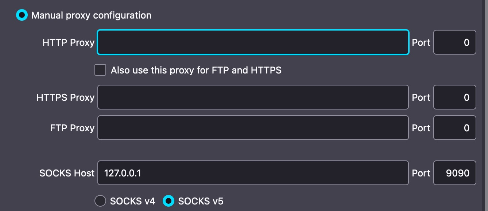
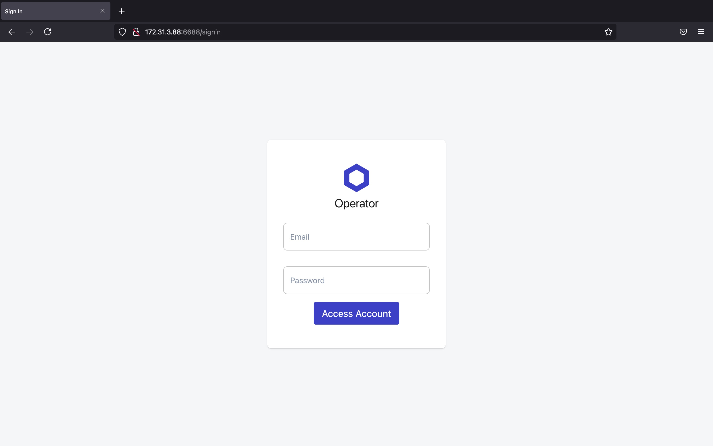

# Overview

This project creates a secure Chainlink Node running on an Ubuntu 20.04 EC2 instance using docker. The Chainlink node runs in a private subnet and can be accessed via private networking from a bastion host which is also created. The template creates a VPC and associated networking in addition to a private key which is stored in SSM Parameter Store.

# Installation

AWS CLI must be installed. The command below uses Cloudformation to create the resources specified in cl-install.cfn. This should work out of the box in most AWS regions but has only been tested in us-east-1 so far. Fill in the required values for installation in parameters.json. You'll need the websocket address of an Ethereum node that runs either Rinkeby or Mainnet. This can also be deployed via the AWS console.
```
aws cloudformation create-stack --stack-name chainlink-node --template-body file://cl-install.cfn --parameters file://parameters.json --capabilities CAPABILITY_NAMED_IAM
```

### parameters.json

ETHNetwork - r for Rinkeby, m for Mainnet.   
EthURL - Your wss:// URL.   
Email - Email for GUI Login.   
Guipass - Password for GUI. Must be at least 8 characters.   


# Accessing the Private Key

The private key created by the template can be downloaded by means of the AWS CLI. You need the private key to initiate an SSH connection from your computer to the bastion host. The same private key can be used to SSH into the Chainlink Node via the bastion host if needed. Please note that the default format in the AWS config on your local machine needs to be set to json for this to work, and jq needs to be installed. 

## Writing the Private Key to 'ChainlinkKeyPair.pem' on Local Machine

```
aws ssm get-parameter --name /Chainlink/default/private-key --with-decryption | jq -r '.Parameter.Value' > ChainlinkKeyPair.pem && chmod 400 ChainlinkKeyPair.pem
```
## Writing the Private Key to 'ChainlinkKeyPair.pem' on Bastion Host
```
export AWS_DEFAULT_REGION=$(curl --silent http://169.254.169.254/latest/dynamic/instance-identity/document | jq -r .region) && aws ssm get-parameter --name /Chainlink/default/private-key --with-decryption | jq -r '.Parameter.Value' > ChainlinkKeyPair.pem && chmod 400 ChainlinkKeyPair.pem
```
# Accessing the Chainlink Node UI

To access the Chainlink Node UI, it's convenient to create a SOCKS5 proxy on your local machine. From there, you can use a browser to access the Chainlink Node UI via the server's private IP address on port 6688. Firefox is recommended as it provides easy setup for SOCKS5 proxies via the Preferences menu. 



The command below creates a SOCKS5 proxy to the bastion host via SSH on localhost port 9090. 

```
ssh -D 9090 -q -C -N -i ChainlinkKeyPair.pem ubuntu@$(aws ec2 describe-instances --filters 'Name=tag:Name,Values=Bastion' 'Name=instance-state-name,Values=running' --query 'Reservations[*].Instances[*].[PublicIpAddress]' --output text)
```
The command below will give you the Chainlink Node's private IP address where the UI will be available on port 6688 through the proxied browser. The private IP address will be in the 172.31.3.0/24 subnet.
```
aws ec2 describe-instances --filters 'Name=tag:Name,Values=ChainlinkNode' 'Name=instance-state-name,Values=running' --query 'Reservations[*].Instances[*].[PrivateIpAddress]' --output text
``` 



# Improvements

A number of things could be done to improve this project. The template currently creates a NAT Gateway which can be expensive and unnecessary for some environments. Expansion could involve giving users the option to choose a cheaper NAT instance as well. Instance sizes and disk space could be parameterized and made configurable. Redundant nodes could be configured to make the system highly available. Security could be improved by adding a VPN to the bastion host or utilizing AWS Client VPN to create a direct connection to the VPC. Ethereum node options could be expanded by adding AWS Managed Blockchain to the template and integrating this with the parameters. The database could be run on RDS. AWS Inspector could be used for security compliance and auditing. Serverless options could also be explored including using ECS or EKS for running the Chainlink Node on Fargate and Aurora Serverless for running Postgres. 

# References:  
  
##### https://github.com/devlintrace/laxinstall
##### https://github.com/thodges-gh  
